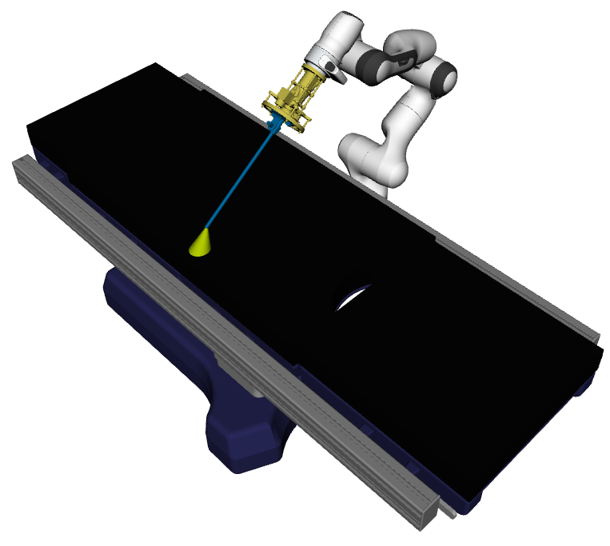

# The Hera Description package includes a complete description of the Operating Theatre



## Current description features
* Robots: Franka Emika Panda
* Phantoms: Open Help Phantom
* Operating Room Tables: Alphastar
* End Effectors: MILC_V1

## Structure
* [common](hera_description/common)
    * contains config files for RViz
* [launch](hera_description/launch)
    * contains launch files to load the description into the ROS parameter server and start a test
* [media](hera_description/media)
    * contains media for documentation
* [meshes](hera_description/meshes)
    * contains visual and collision files for the models
* [urdf](hera_description/urdf)
    * contains urdf descriptions for the models and a meta xacro for the complete scene [hera_operating_theatre.xacro](hera_description/urdf/hera_operating_theatre.xacro)

## Usage

1. Testing the current description as defined in [hera_operating_theatre.xacro](hera_description/urdf/hera_operating_theatre.xacro) and called in [hera_main.urdf.xacro](hera_description/urdf/hera_main.urdf.xacro)
```console
roslaunch hera_description test_description.launch
```


2. Loading the current description as defined in [hera_operating_theatre.xacro](hera_description/urdf/hera_operating_theatre.xacro) and called in [hera_main.urdf.xacro](hera_description/urdf/hera_main.urdf.xacro) into the ROS parameter server
```console
roslaunch hera_description hera_description_upload.launch
```
Call `rosparam get /robot_description -p` to check whether that worked correctly
